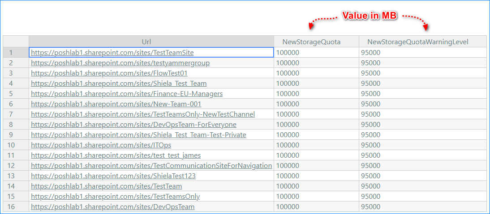
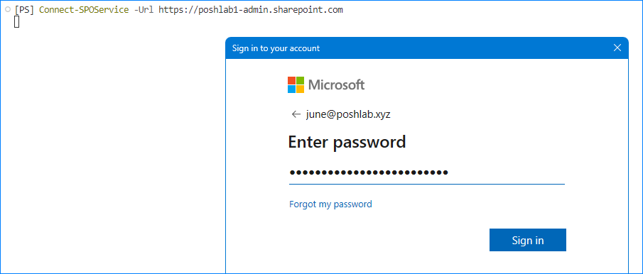
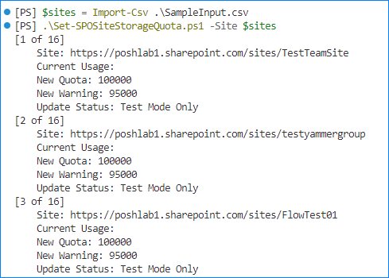
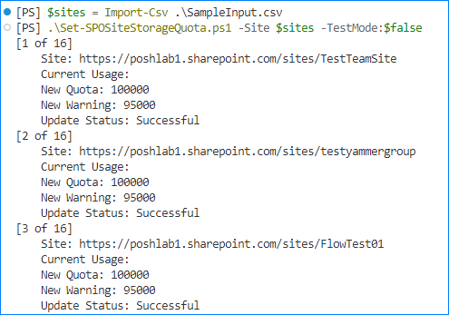

# Set SPO Site Storage Quota PowerShell Script

## Overview

This script takes a CSV input file containing the list of SharePoint URLs, New Storage Quota value, and New Storage Quota Warning Level value.

## Requirements

This script requires the following:

* The [`Microsoft.Online.SharePoint.PowerShell module`](https://learn.microsoft.com/en-us/powershell/module/sharepoint-online/?view=sharepoint-ps) installed.
  * This script was tested with version 16.0.24009.12000 (minimum).
* Windows PowerShell 5.1.
  * The `Microsoft.Online.SharePoint.PowerShell module` does not work with PowerShell Core (7x.)
* Your account must be a SharePoint Administrator.

## The Input File Specifics

This script will only work if:

1. The following column headings (fields) are detected: `URL`, `NewStorageQuota`, `NewStorageQuotaWarningLevel`.

    * `URL` - The SharePoint Online Site URL
    * `NewStorageQuota` - The new storage quota value in MB. For example, **100000** for **100 GB**.
    * `NewStorageQuotaWarningLevel` - The new storage quota warning level value in MB. For example, **95000** for **95 GB**.

2. All fields stated above fields must have a value. If any of the fields or the entire row is empty, the script will terminate.

### Input File Example



## How to Run the Script

1. Download the script first and save it to your preferred location/path.
2. Connect to your SharePoint Online Shell (`Connect-SpoService`).
   
3. Run the script:

    > Note: The script runs in **TEST MODE** by default. To disable test mode, use the `-TestMode:$false` parameter.

   ```PowerShell

   $sites = Import-Csv .\SampleInput.csv

   # Test Mode
   .\Set-SPOSiteStorageQuota.ps1 -Site $sites

   # Live Move
   .\Set-SPOSiteStorageQuota.ps1 -Site $sites -TestMode:$false

   ```

## Sample Output

### Test Mode

   

### Live Mode

   
